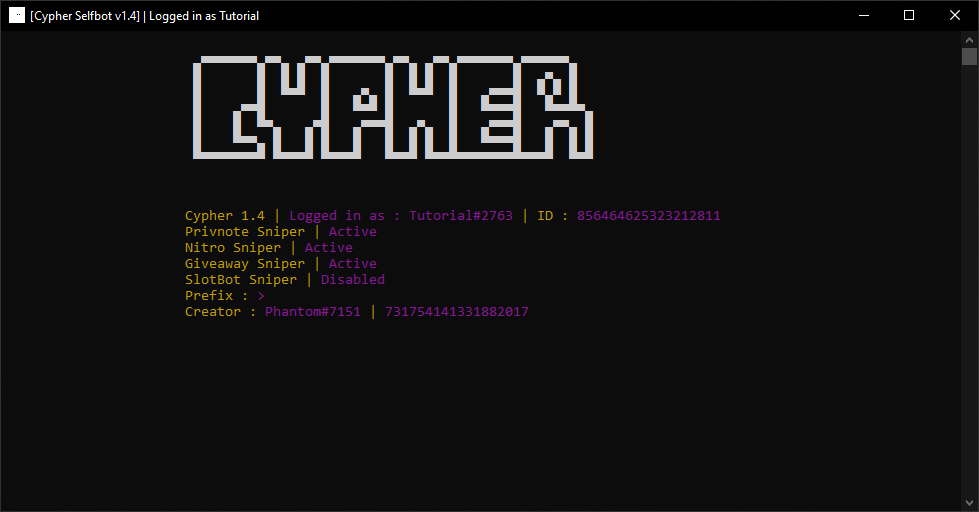

# Installation : 

---

If you haven't already, buy [Cypher Selfbot](https://github.com/SealedSaucer/Cypher-Selfbot) from [Phantom#7151](https://discord.com/users/731754141331882017). Join our [Discord Server](https://dsc.gg/phantom) if you are facing any issues while DM-ing

---

- Unzip the `Cypher Selfbot.zip` file
- Open the `Cypher Selfbot` folder and run the `Cypher Setup.bat` file
- It should create all the directories needed
- Open the `config.json` file and fill the fields

---

| Key  | Value |
| ------------- | ------------- |
| token  | Your Discord Account Token ([How to get your Discord Token](https://youtu.be/sYGdDLLu8cU))  |
| password  | Your Discord Account Password (You need this for the `set-pfp` and `pfp-steal` command)  |
| prefix  | Your Bot Prefix (Check [COMMANDS.md](COMMANDS.md) for more information)  |
| nitro_sniper  | Set this to `false` if you don't want a Nitro Sniper on your account  |
| giveaway_sniper  | Set this to `false` if you don't want a Giveaway Sniper on your account  |
| slotbot_sniper  | Set this to `true` if you want a Slotbot Sniper on your account  |
| privnote_sniper  | Set this to `false` if you don't want a Privnote Sniper on your account  |
| stream_url  | The URL you want others to be redirected when they click on your Streaming Status  |
| tts_language  | The language you want to hear the message in when you use a Text-To-Speech Command  |

---

- Go to [chromedriver.chromium.org/downloads](https://chromedriver.chromium.org/downloads) and download the exact version of Chromedriver of your Chrome Browser

---

### How to check your Chrome Version : 
- Open Chrome
- Settings -> About Chrome -> and it should show your Chrome Version like : `Version 94.x.xxxx.xx`

---

- Download the Chromedriver of your Chrome's Version and OS (`wins32` if you are using windows)
- Extract the downloaded `.zip` file
- Open the extracted folder and cut the `chromedriver.exe` file
- Paste the `chromedriver.exe` file in the same folder as the `Cypher Launcher.exe` file
- Run the `Cypher Launcher.exe` file

---

### If you have done all the above steps properly, it should show a screen like this : 

Congrats! The selfbot is now up and running!

---

You can go through the [COMMANDS.md](COMMANDS.md) to check the commands.

---

#### If it didn't show up like that/If it is showing any errors, please don't hesitate to [contact me](https://discord.com/users/731754141331882017) through Discord or via my [Discord Server](https://dsc.gg/phantom).
